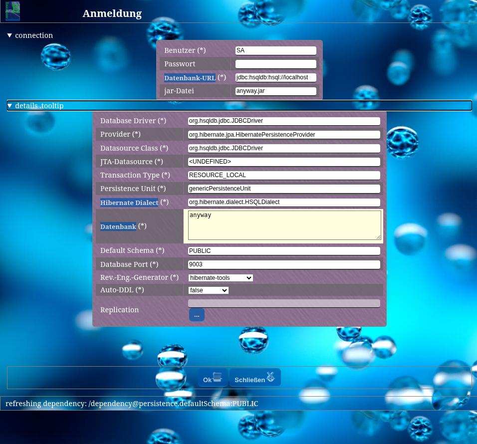
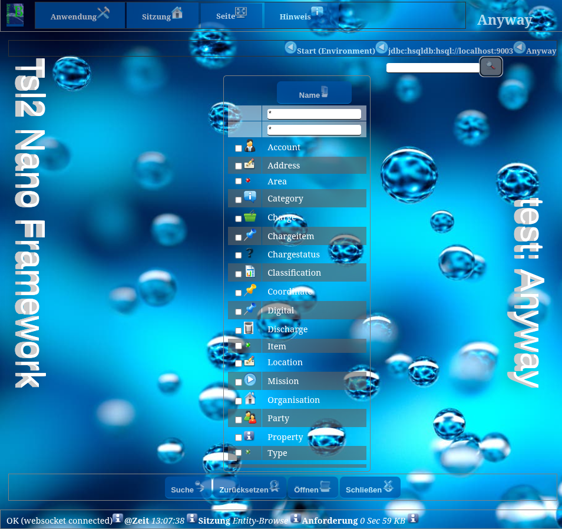
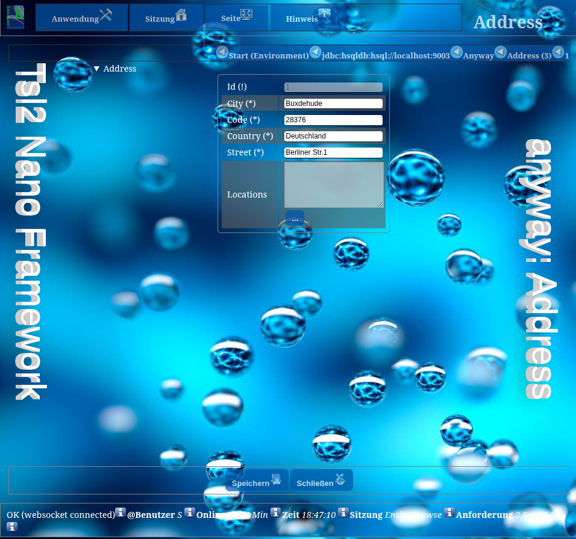
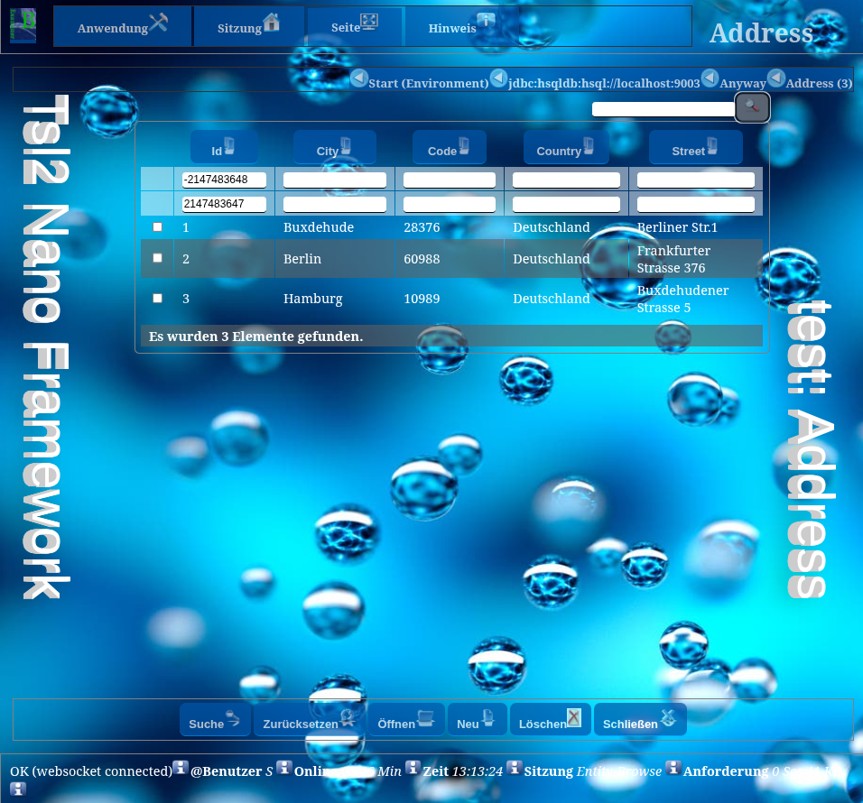

# TSL2 Html5 Application Framework

## Homepage

[home on sourceforge](https://sourceforge.net/projects/tsl2nano/)

## Content

[pom](pom.xml) 

## Features

* pure model implementation + platform independence (naked objects, works on android, too).
* small, having as less as possible static dependencies to other libraries
* using with zero code possible
* everything has a default - all defaults are configurable (Convention over Configuration)
* application, session and entity behaviors are configurable
* implementation through simple java beans + optional bean presenters
* you develop ui independent, but are able to use ui dependent extensions.
* no new language to learn. knowing html5 allows to improve layout and styling.
* navigates through given beans, showing bean-lists and bean-detail dialogs.
* resolves all bean/entity relations to be browsed.
* navigation can be a configurable workflow - or simply an entity browser 
* pre-defines formatting, validation and presentation of relations
* pure html-5 (no javascript, only html5-scripting-api for websockets)
* jvm scripts like javascript, groovy and python can be included by rules using the java scriptengine
* using websockets to show status messages, input-assist and dependency field or timer refreshing
* using websockets to provide a chat system
* pure jpa - jpa-annotations are read to resolve attribute-presentation
* independent of a special o/r mapper. all o/r mappers supporting javax.persistence with an EntityManager are usable.
* simple database replication on user-loaded data - offline working possible
* full key-navigation (shortcuts)
* framework designs interfaces and provides extendable implementations
* useable as standalone or web-service (with offline access), can connect to application-server or works standalone.
* many features through nano.common, and nano.incubation like a rule, sql, action engine, network executor etc.
* resolves all external (jdbc-drivers, etc.) jar-dependencies on runtime on an available network connection
* handling blobs of data (byte[]) to be presented in html as picture, audio, video or object.
* providing attributes as virtuals (not bound to a real bean-attribute, rule-expressions, sql-query-expressions and RESTful-service-call-expressions
* automatic translations through network connection
* secure connection over https and wss (_app.ssl.activate=true)
* supporting yaml on environment and bean configurations.
* update mechanism
* injecting own logic on the forms html dom document
* inject onw logic in all phases of presenting through annotations
* show complex dialogs through websockets to edit beans without leaving the current page
* REST service for access/modification of all loaded entities

## Documentation

[Wiki-Documentation](tsl2.nano.h5/nano.h5.md.html)

## Code

* [sourceforge](https://sourceforge.net/p/tsl2nano/code/ci/master/tree/)
* [github](https://github.com/snieda/tsl2nano.git)

## Screenshots

