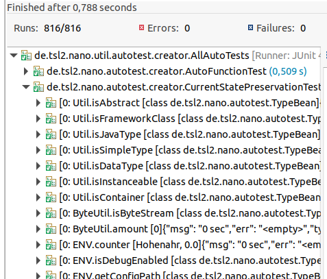

# Automatic Unit Test Creation

Thomas Schneider 04/2021-2024

## Overview

maven artifact: *net.sf.tsl2nano:tsl2.nano.autotest:2.5.2*

This is a java unit test generation framework to create automated tests for you. If you don't want to know, how it works and only want to check, if it works for you, go to the last chapter *All together*

## Introduction

Unit testing with a good code coverage is essential for modern software. test-driven development seems to be a productive way to implement new software. but unit tests are expensive. 
Developers are lazy - they always want to automate the things they have to do ;-)

Isn't there any way to automate some test creation? Why do we not declare expectations as annotations on our functions or methods to provide something like a specification for the implementation of the function? If we have a function - what's about the *inverse function*? Couldn't we declare an existing inverse function to be used by a test creation implementation?

But if we declare *Expections* or *Inverse functions*, we need a mechanism to fill method parameters randomly (or with expectation values). For complex objects , we need a test object implementation holding all java types as attributes. Further more we need a conversion framework to provide parameters in the right type.

The framework tsl2nano provides the base for the implementation. A parameterized Unit Test uses features like declared Expectations and Inverse Functions to do the tests. It is extendable to add more features with new annotations and tester-implementations.

But, at the end I'm to lazy to create the Expectation Annoations by myself. Is there any way to let that create anyone for me?
Yes, the *AutoTestGenerator* can do that for you. It collects all available classes (may be filtered by you), finds out all
callable methods and tries to run them with randomized values. The result will be stored as Expectation Annoations in a file. The file will be read again, the expectations will be handled like they were created by you as method annotations. A pre-test checks, that the test wont fail. Now, a parametrized unit test *CurrentStatePreservationTest* runs all that tests.

It is up to you to copy/paste the generated annotations to the methods in your source code then the annotations would be found be the *AutoFunctionTest*. But only if you like ;-)

Using this autotest library on the tsl2 framwork with 30 maven modules and about 260.000 instructions we pushed the code coverage from 62% to 72% - and found with that some bugs to be fixed :-)
Using only the tests from autotest on that framework, that coverage grows from zero to 50 percent or more.

So, it is a solution to provide generated and reusable junit tests to enhance your tested code coverage - and to analyze (or hold/document) the current state of a new or old software.

Additionally, there are the following Implementations:

* _ValueRandomizer_  : is able to create random values of any java type
* _TypeBean_         : example implementation of a java bean holding all java types as bean attributes
* _BaseTest_         : base class for own unit tests providing expectations and textcomparisons (ignoring defined blocks of temporary text)
* _TextComparison_   : provides text comparisons with ignoring of defined regular expression blocks
* DependencyInjector : provides an injection mechanism to fill members after instance creation and before test method invocation
* ADefaultAutoTester : base of the autotest Test-Classes to provide test framework integration like mockito

### An Overview

TODO: use 
~~~~~~~~~~~~~~~~~~~~~~~~~~~~~~~~~~~~~~~~~~~~~~~~~~~~~~~~~~~~~~~~~~~~~~~~~~~~~~
AllAutoTests -> {InitAllAutoTests, AutoFunctionTest, CurrentStatePreservationTest}
InitAllAutoTests -> {AllAutoTests.init}
AutoFunctionTest -> {InverseFunctionTester, ExpectationFunctionTester, Parameters}
InverseFunctionTester -> "calls all functions having annotation @InverseFunction"
ExpectationFunctionTester -> "calls all functions having annotation @Expectation"
Parameters -> "gets result of AutoTestGenerator.createExpectationTesters()"
AutoTestGenerator -> "creates AFunctionCaller for each method to test"
AFunctionCaller -> "uses ValueRandomizer to create instance construction and method arguments"
CurrentStatePreservationTest -> "uses AFunctionTester for each method with expectation to test"
~~~~~~~~~~~~~~~~~~~~~~~~~~~~~~~~~~~~~~~~~~~~~~~~~~~~~~~~~~~~~~~~~~~~~~~~~~~~~~

### Constraints: What does it not

Methods on instances with complex constructors or with complex parameters may not work. They will be filtered.

If you have methods that return a value depending on a current system state, the results wont be stable and testable here.

Examples:

* your method returns the count of cached objects -> that will vary on each call
* your method returns something dependent on current system time, memory usage or file system state

### What the Generator and the AutoFunctionTest do

The *AutoTestGenerator* does the following steps:

* perhaps, delete some files from last run
* evaluate all methods in classpath (using ClassFinder) through given filter
* filter methods, that does not match the configured requirements (synthetic/local/anonymous or complex types)
* go through all remaining methods and:
	* duplicate the methods to be run for different random arguments
	* create instance (of declaring class) with random constructor arguments
	* perhaps inject instances through DependencyInjector and/or *fillInstance*
	* create random method arguments
	* call AllAutoTests.before() if available
	* call the method and store the resulting exception or return value
	* call AllAutoTests.after() if available
	* filter methods with hard errors
	* create a @Expection annotation (when...->then...)
* use the @Expectation annotation files and:
	* try to recreate the instance of declaring class
	* perhaps inject instances through DependencyInjector and/or *fillInstance*
	* try to recreate the method arguments
	* call AllAutoTests.before() if available
	* start the method and compare the result with the expectation
	* call AllAutoTests.after() if available
	* filter methods having different results on same call
	* twice: start the method (with before and after) and compare the result with the expectation again
	* twice: filter methods having different results on same call
	* save text file with @Expection annotation (when...->then...)
* save a generation/test statistic
* load all expectations from file and return them as result

Now, the *AutoFunctionTest* starts all the returned tests with expectations:
	* run the remaining expectations  (with before and after) as real parameterized unit tests

NOTE:
* A problem can be a different environment between first method starts and the restart through a junit environment. You'll see that e.g. in different MethodAccessor implementations (NativeMethodAccessorImp: IllegalArgument: argument type mismacht <-> GeneratedMethodAccessor1: IllegalArgument: ClassCastException)
* using the *DependencyInjection* or *fillInstance* may result in unpredictable instances on same test

### Todos and Ideas

* extra check *boundary conditions* to test on minimum and maximum values
* enhance @Expect with "with" annotation for boundaries
* interpret java bean validation annotations for value boundaries

## Code Review

The Test Creator (the class *AutoFunctionTest*) defines the features to be tested. Some properties like a *test name filter*, *test duplication* etc. can be set by system properties.

At the moment, we have two features with their tester implementations:

* InverseFunction -> InverseFunctionTester
* Expectations    -> ExpectationsTester

The *AutoTestGenerator* is able to generate unit tests for all methods in your classpath. It tests the state as is.

Two parametrized Unit Tests provide the real unit tests:

* *AutoFunctionTest*: will test all annotations of type _Expectation_ and _InverseFunction_
* CurrentStatePreservationTest*: uses *AutoTestGenerator* to create Expectation Tests for all found methods

Both Test classes extend the *ADefaultAutoTester* (providing mechanisms like *before*, *after* initializing e.g. test-frameworks like mockito)

## Usage of Test Annotations

First, you need a junit dependency on **junit:junit:4.12** or newer.

The annotations are packed into the tsl2nano core jar. So, you need a maven dependency for *tsl2.nano.core*. The *AutoFunctionTest* is included in the package *tsl2.nano.autotest*. Please add a maven dependency on scope *test*.

*tsl.nano.core*:

~~~~~~~~~~~~~~~~~~~~~~~~~~~~~~~~~~~~~~~~~~~~~~~~~~~~~~~~~~~~~~~~~~~~~~~~~~~~~~
	<dependency>
		<groupId>net.sf.tsl2nano</groupId>
		<artifactId>tsl2.nano.core</artifactId>
		<version>2.5.2</version>
		<scope>test</scope>
	</dependency>
~~~~~~~~~~~~~~~~~~~~~~~~~~~~~~~~~~~~~~~~~~~~~~~~~~~~~~~~~~~~~~~~~~~~~~~~~~~~~~

the test framework *tsl2.nano.autotest*:

~~~~~~~~~~~~~~~~~~~~~~~~~~~~~~~~~~~~~~~~~~~~~~~~~~~~~~~~~~~~~~~~~~~~~~~~~~~~~~
	<dependency>
		<groupId>net.sf.tsl2nano</groupId>
		<artifactId>tsl2.nano.autotest</artifactId>
		<version>2.5.2</version>
		<scope>test</scope>
	</dependency>
~~~~~~~~~~~~~~~~~~~~~~~~~~~~~~~~~~~~~~~~~~~~~~~~~~~~~~~~~~~~~~~~~~~~~~~~~~~~~~

The Test Creator *AutoFunctionTest* should be activated by adding it to a Test Suite

The usage will be shown by some examples. For further informations, have a look at the code or the java doc.

### Expectations

looking at a specific parameter (through its index) , setting it with 'whenPar()' and checking it with 'then()'

~~~~~~~~~~~~~~~~~~~~~~~~~~~~~~~~~~~~~~~~~~~~~~~~~~~~~~~~~~~~~~~~~~~~~~~~~~~~~~
	@Expectations({@Expect(parIndex = 0, whenPar = "1.0", then = "2.0"), @Expect(parIndex = 0, whenPar = "2.0", then = "3.0")})
	public static Number increase(Number input) {
		return input.doubleValue() + 1;
	}
~~~~~~~~~~~~~~~~~~~~~~~~~~~~~~~~~~~~~~~~~~~~~~~~~~~~~~~~~~~~~~~~~~~~~~~~~~~~~~

looking at all method parameters:

~~~~~~~~~~~~~~~~~~~~~~~~~~~~~~~~~~~~~~~~~~~~~~~~~~~~~~~~~~~~~~~~~~~~~~~~~~~~~~
	@Expectations({@Expect(when = {"1", "2", "3"}, then = "123")})
	public String concatNumbers(short first, int second, Long third) {
		return "" + first + second + third;
	}
~~~~~~~~~~~~~~~~~~~~~~~~~~~~~~~~~~~~~~~~~~~~~~~~~~~~~~~~~~~~~~~~~~~~~~~~~~~~~~

### InverseFunction

checking simple getter and setter:

~~~~~~~~~~~~~~~~~~~~~~~~~~~~~~~~~~~~~~~~~~~~~~~~~~~~~~~~~~~~~~~~~~~~~~~~~~~~~~
	@InverseFunction(methodName = "setValue", parameters = { String.class })
	public String getValue() {
		return value;
	}

	public void setValue(String value) {
		this.value = value;
	}
~~~~~~~~~~~~~~~~~~~~~~~~~~~~~~~~~~~~~~~~~~~~~~~~~~~~~~~~~~~~~~~~~~~~~~~~~~~~~~

having a simple mathematic function with its inverse function:

~~~~~~~~~~~~~~~~~~~~~~~~~~~~~~~~~~~~~~~~~~~~~~~~~~~~~~~~~~~~~~~~~~~~~~~~~~~~~~
	@Expectations({@Expect(parIndex = 0, whenPar = "1.0", then = "2.0"), @Expect(parIndex = 0, whenPar = "2.0", then = "3.0")})
	public static Number increase(Number input) {
		return input.doubleValue() + 1;
	}

	@InverseFunction(methodName = "increase", parameters = { Number.class }, compareParameterIndex = 0)
	public static Number decrease(Number input) {
		return input.doubleValue() - 1;
	}
~~~~~~~~~~~~~~~~~~~~~~~~~~~~~~~~~~~~~~~~~~~~~~~~~~~~~~~~~~~~~~~~~~~~~~~~~~~~~~

writing/reading to something like a stream:

~~~~~~~~~~~~~~~~~~~~~~~~~~~~~~~~~~~~~~~~~~~~~~~~~~~~~~~~~~~~~~~~~~~~~~~~~~~~~~
	static Map<String, Object> fileData;
	enum FileType {CSV, TABSHEET, MARKDOWN};

	public static void writeFile(Object data, FileType fileType, String path, String filename, boolean append) {
		fileData = MapUtil.asMap(path + filename + fileType, data);
	}
	@InverseFunction(methodName = "writeFile", 
			parameters = {Object.class, FileType.class, String.class, String.class, boolean.class}, 
			compareParameterIndex = 0, bindParameterIndexesOnInverse = {2, 3, 1})
	public static Object readFile(String path, String filename, FileType fileType) {
		return fileData.get(path + filename + fileType);
	}
~~~~~~~~~~~~~~~~~~~~~~~~~~~~~~~~~~~~~~~~~~~~~~~~~~~~~~~~~~~~~~~~~~~~~~~~~~~~~~

### ValueRandomizer

The value randomizer can create randomized values for all java types. 

Example with an parametrized test, creating a set of randomized values:

~~~~~~~~~~~~~~~~~~~~~~~~~~~~~~~~~~~~~~~~~~~~~~~~~~~~~~~~~~~~~~~~~~~~~~~~~~~~~~

	@RunWith(Parameterized.class)
	public class ParameterizedBeanTest {

	private Object[] typeBeans;

	/** will be called for each item in the result collection of parameters() */
	public ParameterizedBeanTest(Object[] typeBeans) {
		this.fileType = filetype;
		this.typeBeans = typeBeans;
		filename = filename + filetype;
	}

	@Parameters(name="{0}")
	public static Collection<Object[]> parameters() {
		LinkedList<Object[]> list = new LinkedList<>();
		for (FileType fileType : FileType.values()) {
			// here you see the standard call to fill a TypeBean.class with random values (creating two instances)
			list.add(new Object[] { ValueRandomizer.provideRandomizedObjects(2, TypeBean.class)});
		}
		return list;
	}
	
	@Test
	public void testMyBean() {
		// here we use the member, filled on construction
    	checkMyBeans(typeBeans);
	}

~~~~~~~~~~~~~~~~~~~~~~~~~~~~~~~~~~~~~~~~~~~~~~~~~~~~~~~~~~~~~~~~~~~~~~~~~~~~~~

#### ValueSets

The ValueRandomizer respects zero numbers (on test duplication > 2) and provides loading of value sets.

A value set will be loaded from file with file name equal to the java class name. The values have to be separated by java carriage return ('\n').

On Comparables like numbers, the value set may only be an area with a min and max value, separated by '<->'.

Area of numbers:

~~~~~~~~~~~~~~~~~~~~~~~~~~~~~~~~~~~~~~~~~~~~~~~~~~~~~~~~~~~~~~~~~~~~~~~~~~~~~~
-5.0<->5.0

~~~~~~~~~~~~~~~~~~~~~~~~~~~~~~~~~~~~~~~~~~~~~~~~~~~~~~~~~~~~~~~~~~~~~~~~~~~~~~

Example:

~~~~~~~~~~~~~~~~~~~~~~~~~~~~~~~~~~~~~~~~~~~~~~~~~~~~~~~~~~~~~~~~~~~~~~~~~~~~~~
randomize value type: java.lang.String -> will be loaded from optional file 'string.set'
~~~~~~~~~~~~~~~~~~~~~~~~~~~~~~~~~~~~~~~~~~~~~~~~~~~~~~~~~~~~~~~~~~~~~~~~~~~~~~

sample content for string.set:

~~~~~~~~~~~~~~~~~~~~~~~~~~~~~~~~~~~~~~~~~~~~~~~~~~~~~~~~~~~~~~~~~~~~~~~~~~~~~~
Name1
Name2
Name3
~~~~~~~~~~~~~~~~~~~~~~~~~~~~~~~~~~~~~~~~~~~~~~~~~~~~~~~~~~~~~~~~~~~~~~~~~~~~~~

For type String (->string.set) there is a default valueset with german city names.

#### Exceptional instancing on PrintWriters

The String Constructor of class *PrintWriter* will create a file in the *user.dir* folder with given name as file name. On testing , this may result in files with random names inside your working directory. To avoid that, the *ValueRandomizer* will explicitly create the randomized PrintWriters into the test directory - using the File-Constructor.

### TypeBean

in the ValueRandomizer example you have already seen the creation of randomized TypeBeans. In the following
simple example we directly create one instance of TypeBean.class with randomized values

~~~~~~~~~~~~~~~~~~~~~~~~~~~~~~~~~~~~~~~~~~~~~~~~~~~~~~~~~~~~~~~~~~~~~~~~~~~~~~
	// giving a parameter of true, the TypeBean will fill itself with randomized values
	TypeBean myTestBean = new TypeBean(true);
~~~~~~~~~~~~~~~~~~~~~~~~~~~~~~~~~~~~~~~~~~~~~~~~~~~~~~~~~~~~~~~~~~~~~~~~~~~~~~

### TextComparison

example of using text comparison with ignore expressions:

~~~~~~~~~~~~~~~~~~~~~~~~~~~~~~~~~~~~~~~~~~~~~~~~~~~~~~~~~~~~~~~~~~~~~~~~~~~~~~
      exptectedHtml = new String(FileUtil.getFileBytes(expFileName, null));
      BaseTest.assertEquals(exptectedHtml, html, true, MapUtil.asMap("\\:[0-9]{5,5}", ":XXXXX",
          "20\\d\\d(-\\d{2})*", BaseTest.XXX,
          "[0-9]{1,6} Sec [0-9]{1,6} KB", "XXX Sec XXX KB", 
          "statusinfo-[0-9]{13,13}\\.txt", "statusinfo-XXXXXXXXXXXXX.txt",
          BaseTest.REGEX_DATE_US, BaseTest.XXX,
          BaseTest.REGEX_DATE_DE, BaseTest.XXX,
          BaseTest.REGEX_TIME_DE, BaseTest.XXX,
          ));
~~~~~~~~~~~~~~~~~~~~~~~~~~~~~~~~~~~~~~~~~~~~~~~~~~~~~~~~~~~~~~~~~~~~~~~~~~~~~~

### ADefaultAutoTester

As base of the autotest Testclasses it tries to call your AllAutoTests class methods *before* and *after on each test - if existing. It provides the possibility to mock objects with mockito.

Full Example (from tsl2.nano.serviceaccess):

~~~~~~~~~~~~~~~~~~~~~~~~~~~~~~~~~~~~~~~~~~~~~~~~~~~~~~~~~~~~~~~~~~~~~~~~~~~~~~
package de.tsl2.nano.util.autotest.creator;

import static de.tsl2.nano.autotest.creator.InitAllAutoTests.matchPackage;

import java.lang.reflect.Proxy;
import java.util.Arrays;

import javax.annotation.Resource;
import javax.persistence.EntityManager;
import javax.persistence.PersistenceContext;

import org.junit.runner.RunWith;
import org.junit.runners.Suite;
import org.junit.runners.Suite.SuiteClasses;

import de.tsl2.nano.autotest.ValueRandomizer;
import de.tsl2.nano.autotest.creator.ADefaultAutoTester;
import de.tsl2.nano.autotest.creator.AutoFunctionTest;
import de.tsl2.nano.autotest.creator.CurrentStatePreservationTest;
import de.tsl2.nano.autotest.creator.InitAllAutoTests;
import de.tsl2.nano.bean.BeanContainer;
import de.tsl2.nano.bean.BeanProxy;
import de.tsl2.nano.core.ENV;
import de.tsl2.nano.core.util.ConcurrentUtil;
import de.tsl2.nano.core.util.DependencyInjector;
import de.tsl2.nano.core.util.StringUtil;
import de.tsl2.nano.resource.fs.FsConnection;
import de.tsl2.nano.service.feature.FeatureProxy;
import de.tsl2.nano.service.schedule.JobScheduleServiceBean;
import de.tsl2.nano.service.util.BeanContainerUtil;
import de.tsl2.nano.service.util.GenericServiceBean;
import de.tsl2.nano.service.util.IGenericService;
import de.tsl2.nano.service.util.ServiceRunner;
import de.tsl2.nano.service.util.ServiceUtil;
import de.tsl2.nano.service.util.batch.CachingBatchloader;
import de.tsl2.nano.serviceaccess.Authorization;
import de.tsl2.nano.serviceaccess.IAuthorization;
import de.tsl2.nano.serviceaccess.ServiceFactory;
import de.tsl2.nano.serviceaccess.ServiceProxy;

@RunWith(Suite.class)
@SuiteClasses({InitAllAutoTests.class, AutoFunctionTest.class, CurrentStatePreservationTest.class})
public class AllAutoTests {

	public static void init() {
		// ConfigBeanContainer.initAuthAndLocalBeanContainer();

		System.setProperty("tsl2.functiontest.filter",
				matchPackage(FsConnection.class, ServiceUtil.class, ServiceFactory.class, GenericServiceBean.class,
						JobScheduleServiceBean.class, FeatureProxy.class, CachingBatchloader.class,
						ServiceRunner.class));
		System.setProperty("tsl2.functiontest.filter.exclude", ".*(FsManagedConnection.setLogWriter|FsManagedConnectionFactory.setLogWriter|PrintWriter|DefaultService.getSubject).*");
		System.setProperty(ADefaultAutoTester.KEY_AUTOTEST_INITMOCKITO, "true");
		System.setProperty(DependencyInjector.KEY_INJECTORANNOTATIONS,
				StringUtil.trim(Arrays.toString(ADefaultAutoTester.DEFAULT_MOCK_CLASSNAMES), "{}[]"));

		ValueRandomizer.setDependencyInjector(new DependencyInjector(
				Arrays.asList(Resource.class, PersistenceContext.class, jakarta.persistence.PersistenceContext.class),
				Arrays.asList(DependencyInjector.Producer.class), null));
	}
}

//copy of ConfigBeanContainer in directacccess
class ConfigBeanContainer {
	public static EntityManager initAuthAndLocalBeanContainer() {
		return initProxyBeanContainer(initUserAuth());
	}

	public static EntityManager initProxyBeanContainer(Authorization auth) {
		BeanContainerUtil.initEmptyProxyServices();
		BeanContainerUtil.initProxyServiceFactory();
		ServiceFactory.instance().setSubject(auth.getSubject());
		ConcurrentUtil.setCurrent(BeanContainer.instance());
		return ENV.addService(EntityManager.class, BeanProxy.createBeanImplementation(EntityManager.class));
	}

	public static Authorization initUserAuth() {
		Authorization auth = Authorization.create("SA", false);
		ENV.addService(IAuthorization.class, auth);
		ConcurrentUtil.setCurrent(auth);
		return auth;
	}

	/**
	 * use that only, if you called initProxyBeanContainer() before!
	 */
	public static IGenericService getGenServiceProxy() {
		return (IGenericService) ((ServiceProxy) Proxy.getInvocationHandler(ServiceFactory.getGenService()))
				.delegationProxy();
	}

	public static void simpleReturnExampleItself() {
		BeanProxy.doReturnWhen(getGenServiceProxy(), (m, a) -> Arrays.asList(a[0]), "findByExample");
		BeanProxy.doReturnWhen(getGenServiceProxy(), (m, a) -> Arrays.asList(a[0]), "findByExampleLike");
		BeanProxy.doReturnWhen(getGenServiceProxy(), (m, a) -> Arrays.asList(a[0]), "findBetween");
	}
}
~~~~~~~~~~~~~~~~~~~~~~~~~~~~~~~~~~~~~~~~~~~~~~~~~~~~~~~~~~~~~~~~~~~~~~~~~~~~~~

## Usage of AutoTestGenerator and CurrentStatePreservationTest

The *CurrentStatePreservationTest* tries to do all for you. Calling the *AutoTestGenerator* will find all available classes and methods in your classpath, trying to call all methods, storing the results and restoring them as unit tests through the ExpectationTester again.

If you call the test a second time, all generated tests are restored. So, no new generation will be done -> this works as preservation of current state.

There are some parameters (system properties) you can specify. Here, you see the properties (they all have the prefix 'tsl2.functiontest.', e.g.: 'tsl2.functiontest.clean') with their default values:

~~~~~~~~~~~~~~~~~~~~~~~~~~~~~~~~~~~~~~~~~~~~~~~~~~~~~~~~~~~~~~~~~~~~~~~~~~~~~~
AutoTest (PREFIX: 'tsl2.functiontest.') started with:
	user.dir                                         : /home/xxx/workspace/tsl2.nano.autotest/target/autotest
	user.name                                        : xxx
	donttest                                         : false
	forbidsystemexit                                 : false
	duplication                                      : 10
	parallel                                         : true
	timeout                                          : 20
	precheck.twice                                   : true
	testneverfail                                    : false
	filename                                         : autotest/generated/generated-expectations-
	fast.classscan                                   : true
	clean                                            : false
	filter                                           : .*(de.tsl2.nano.core).*
	modifier                                         : -1
	filter.test                                      : .*(IT|Test)
	filter.exclude                                   : .*(DateUtil.getWorkdayCount|ByteUtil.getPipe|IPreferences).*
	filter.unsuccessful                              : true
	filter.void.parameter                            : false
	filter.void.return                               : false
	filter.complextypes                              : false
	filter.singeltons                                : true
	filter.noninstanceables                          : true
	filter.error.types                               : XXXXXXXX
	filter.failing                                   : false
	filter.nullresults                               : false
	allow.single.char.zero                           : false
	allow.single.byte.zero                           : false
	create.randdom.max.depth                         : 10
	valueset.group                                   : default
	valueset.avoid.collision                         : true
~~~~~~~~~~~~~~~~~~~~~~~~~~~~~~~~~~~~~~~~~~~~~~~~~~~~~~~~~~~~~~~~~~~~~~~~~~~~~~

* *donttest*: if true, *AutoTestGenerator* will leave without doing any generation or testing!
* *forbidSystemExit*: if true, a *securitymanager* will be created to disable calls to *System.exit()*. May have collisions with other SecuriyManagers and other permissions - so be careful with this.
* *timeout* : (default: 20) time in seconds for each single test (extra thread will interupt unit test). if timeout = -1, no extra thread will be created to check for timeout. a timeout of 0 will wait forever - without interrupting.
* *filename*: path to generate the auto tests into. on duplication > 0, you will have more than one generated file (e.g.: generated-autotests-0 and generated-autotests-1)
* *fast.classscan*: if true, no class re-scan is done. may find less matches than with re-scan, but is much faster (should be used on classloader with more than 1000 classes)
* *filter.test*: filter for test classes (default: ".*(Test|IT)")
* *filter.exclude*: additional excluding regex filter for methods, that should not be tested by this tests
* *testneverfail*: (default: false) only to check the resulting test coverage - if true, no test of *AllAutoTests* will ever fail. Please dont publish that to your application!
* *clean*: (default: false) whether to delete all previously generated test files prior to start the new tests.
* *duplication*: (default: 10) a duplication of 10 will generate 11 random calls on each method. A duplication > 2 will result in the use of zero numbers in the first test set.
* *filter*: (default: this framework package path) fuzzy class+method filter. NOTE: it's fuzzy finding, means, all 'similar' findings will be included!
* *modifier*: (default: -1) java method mofifier bitfield like *public* (=1) *static* (=8) etc. Please have a look at the java class *java.lang.reflect.Modifier* to see all possibilities 
* *filter.unsuccessful*: (default: true): if true, a pre-check is done, calling the test for a failing result. If the test will fail, it will be filtered from the real test.
* *filter.voidparameter*: (default: false) functions without parameters in a static class can only be tested against an exception (see fail). if set to true, methods without parameters in a static class will be filtered. Doing that, you may have to filter (filter.exclude) some of your classes and/or methods.
* *filter.voidreturn*: (default: false) whether to filter methods having a return type of *void*. without an output like the returned result, an expectation can only tested against having a specific exception or not.
* *filter.complextypes*: (default: false) all method parameter types and the result type will be checked, if they are standard data types (provided by jdk) and single value types.(nothing like arrays, collections and maps)
* *filter.singeltons*: (default: true) filters all classes that have only a non public constructor and a non public field of its own type. singeltons may produce problems on junit testing if used on different tests.
* *	filter.noninstanceables*: (default: true) classes of type interface/abstract/not-public/anonymous may not be instanceable and produce error states for each owned method. there are solutions (e.g. on interfaces and anonymous) to create instances - but sometimes they may fail.
* *filter.error.type*: optionally filter errors occurring on calling the function (e.g. .*OutOfMemory.*). No expectation with a failing will be created.
* *filter.failing*: (default:false) whether it is allowed to have a method call , throwing an exception as expected result.
* *filter.nullresults*: (default: false) whether it is allowed to have a method call, returning *null* as result.
* *allow.single.byte.zero*: (default:false) tells the ValueRandomizer not to create a byte value of 0. 0-bytes may be converted to c chars (\x0) that is an end-delimiter on strings.
* allow.single.char.zero*: (default=false) tells the ValueRandomizer not to create a char value of 0. 0-char (\x0) is an end-delimiter on strings.
* *valueset.group*: (default: 'default'). if empty ('') no valuesets will be used. if 'default', valuerandomizer will look for a resource or file with simle name of type to create a random value for (e.g.: string.set). if not empty and not 'default', the resourde name will have to start with this name (e.g.: 'mygroupname-string.set')
* *valueset.avoid.collision*: (default: true) tries to avoid collisions over all valuesets (except primitives and interval-valuesets). will result in a more stabil test run in cause of avoiding collisions on for example file names. the performance will slow down on collisions in cause of recursion and testing for available values.

*NOTE*: Some properties are set in *InitAllAutoTests*, working on all AutoTests.

The *AutoTestGenerator* finds methods to test, calls them and does a full test - comparing the result to the first call. If successful done, it writes the file *...target/autotest/generated/generated-autotests-XXX.txt with XXX as number of iteration (given by duplication).

Example of generated-autotests-XXX.txt:

~~~~~~~~~~~~~~~~~~~~~~~~~~~~~~~~~~~~~~~~~~~~~~~~~~~~~~~~~~~~~~~~~~~~~~~~~~~~~~
@Expectations({@Expect( when = {"88.00600103264951","Schwalmtal-Storndorf","Zuzenhausen","0"} then = "88.00600103264951"})
public static java.lang.String de.tsl2.nano.core.util.StringUtil.substring(java.lang.StringBuilder,java.lang.String,java.lang.String,int)

@Expectations({@Expect( when = {"Petzow","Extertal-Almena","Ripperterhof"} then = "Petzow"})
public static java.lang.String de.tsl2.nano.core.util.StringUtil.substring(java.lang.String,java.lang.String,java.lang.String)

@Expectations({@Expect( when = {"Korb","Buchfart","Uplengen - Ockenhausen","true","true"} then = "null"})
public static java.lang.String de.tsl2.nano.core.util.StringUtil.substring(java.lang.String,java.lang.String,java.lang.String,boolean,boolean)

@Expectations({@Expect( when = {"Oberhofen","Göggenhofen","Großkarlbach","true"} then = "Oberhofen"})
public static java.lang.String de.tsl2.nano.core.util.StringUtil.substring(java.lang.String,java.lang.String,java.lang.String,boolean)

@Expectations({@Expect( when = {"82.40402009066662","Telgte","Waldsassen"} then = "0"})
public static int de.tsl2.nano.core.util.StringUtil.replaceAll(java.lang.StringBuilder,java.lang.String,java.lang.String)

@Expectations({@Expect( when = {"Großheirath","0"} then = "fail(de.tsl2.nano.core.ManagedException(java.lang.ArithmeticException: / by zero))"})
public static final java.lang.String[] de.tsl2.nano.core.util.StringUtil.split(java.lang.String,int)

@Expectations({@Expect( when = {"Göttingen","Wettenberg"} then = "Göttin"})
public static java.lang.String de.tsl2.nano.core.util.StringUtil.trim(java.lang.String,java.lang.String)

@Expectations({@Expect( when = {"Hadersbach","0","Königswinter"} then = "fail(de.tsl2.nano.core.ManagedException(java.lang.ArithmeticException: / by zero))"})
public static final java.lang.String de.tsl2.nano.core.util.StringUtil.format(java.lang.String,int,java.lang.String)

@Expectations({@Expect( when = {"[32]","[7]"} then = "false"})
public static boolean de.tsl2.nano.core.util.ByteUtil.equals(byte[],byte[])
~~~~~~~~~~~~~~~~~~~~~~~~~~~~~~~~~~~~~~~~~~~~~~~~~~~~~~~~~~~~~~~~~~~~~~~~~~~~~~

There you can see the different types of randomized values and method invokings ending in an exception, that will be used as expected result on the next test run.
This generated files should be stored in your test resources folder to be loaded on next test run. Then you have current state preservation test. Or you copy the lines with @Expectectation annotations and
put them into your source code at the position of the given method.

At the end, you will get a short statistical overview:

~~~~~~~~~~~~~~~~~~~~~~~~~~~~~~~~~~~~~~~~~~~~~~~~~~~~~~~~~~~~~~~~~~~~~~~~~~~~~~
AutoTestGenerator created 542 expectations in file pattern: 'generated/generated-autotests-...'
	end time              : 04.07.2021 18:26:21	duration: 01:00:37
	testneverfail         : false
	classfinder cls/mthds : 600 / 5021
	methods loaded        : 1689	(rate: 0.3363872)
	duplications          : 10	(methods loaded * duplications: 16890)
GENERATION PROCESS:
	created with fail     : 4821
	created with null     : 0
	created totally       : 542
	filtered type error   : 2128
	filtered complex types: 1990
	filtered errors       : 3576
	filtered nulls        : 0
	max duration          : 90 msec		<- 0:XmlUtil.saveXml
	max mem usage         : 24MB			<- 5:AppLoader.start
	GENERATED FUNCTION TESTERS GROUPED BY STATE:
		NEW                   : 0
		FUNC_SYNTHETIC        : 1920
		FUNC_WITHOUT_INTPUT   : 0
		FUNC_WITHOUT_OUTPUT   : 0
		FUNC_COMPLEX_INPUT    : 0
		PARAMETER_UNDEFINED   : 0
		PARAMETER_ERROR       : 2026
		INITIALIZED           : 0
		INSTANCE_ERROR        : 2080
		NULL_RESULT           : 0
		EXECUTION_ERROR       : 2672
		OK                    : 1668
		STORE_ERROR           : 0
		TEST_FAILED           : 3436
		TESTED                : 3088
		<<< TOTALLY >>>       : 16890
LOADING PROCESS:
	filtered unsuccessful : 3436
	load errors           : 169
	loaded unsuccessful   : 408
	totally loaded        : 5183 (load-rate: 0.30686796, total-rate: 0.1031667)
~~~~~~~~~~~~~~~~~~~~~~~~~~~~~~~~~~~~~~~~~~~~~~~~~~~~~~~~~~~~~~~~~~~~~~~~~~~~~~

* *methods loaded*: if the test was not started before, generating the auto tests - or the property clean=true was set, then the *AutoTestGenerator* will load classes and methods (filtered throuth given property filter)
* *duplications*: the count of method calling clones to test the methods with different randomized value parameters
* *created with fail*: if the property *filter.failing* is true (default:false) this is the number of tests throwing an exception
* *created with null*: if the property *filter.nullresults* is true (default:false) this is the number of tests with a result value of null
* *filtered with type error*: if the parameters or the return value is not convertable from/to String, the method will be filtered
* *filtered complex types*: if a method as no return value (->void) or no parameters, or the parameters are to complex, the method will be filtered
* *filtered.unsuccessful*: if the property *filter.unsuccessful* is true (default:true) a test is done before the real unit test. if this test fails, it will be filtered and not provided to the real unit test.
* *load errors*: after *AutoTestGenerator* has generated auto tests, they will be loaded to be provided as unit tests. on load there may occur any errors like unavailable method, wrong method parameters (perhaps anything changed in the source code) or problems on creating the parameter values from string.
* *loaded unsuccessful*: if property filter.unsuccessful is true (default:true), this will do a test run after loading from generated file and before providing it to the real unit test. NOTE: This will hide the failing tests of your current state!
* *totally loaded*: totally loaded real unit tests. this belongs to the number of methods and duplications for the generating process, and on the filtered tests with errors on loading and initializing - or that would fail.

## The Workaround initializing a Suite having parameterized Unit Tests

With the tools of JUnit 4 it is not possible to define a method that is called before creating all parameterized tests of a suite. A @BeforeClass or a static block in the Suite class is started after calling all parameterized() methods. So, we have created a specific Test class that only has to start a method for initializations before calling all unit parameterizings.

Workaround Initialization Test Class:

~~~~~~~~~~~~~~~~~~~~~~~~~~~~~~~~~~~~~~~~~~~~~~~~~~~~~~~~~~~~~~~~~~~~~~~~~~~~~~
@RunWith(Parameterized.class)
public class InitAllAutoTests {

	@Parameters
	public static Collection<?> parameters() {
		BeanClass.callStatic("de.tsl2.nano.util.autotest.creator.AllAutoTests", "init");
		return Arrays.asList();
	}

	@Test public void nothing() {}
}
~~~~~~~~~~~~~~~~~~~~~~~~~~~~~~~~~~~~~~~~~~~~~~~~~~~~~~~~~~~~~~~~~~~~~~~~~~~~~~

## Tip: check the AutoGeneration while debugging with Standard Java Exception Breakpoints

The simplest way to use this framework is to use the *as is* unit tests by *CurrentStatePreservationTest*. But you can try to check for simple errors/exceptions on running the test in your IDE (like eclipse) in debug mode and activating standard java exception breakpoints.

You should set the filter in your AllAutoTests class to match only the function, you want to debug. And you should disable parallel invocation:

~~~~~~~~~~~~~~~~~~~~~~~~~~~~~~~~~~~~~~~~~~~~~~~~~~~~~~~~~~~~~~~~~~~~~~~~~~~~~~
import static de.tsl2.nano.autotest.creator.AutoTest.*;
import static de.tsl2.nano.autotest.creator.InitAllAutoTests.*;
...
public class AllAutoTests {
	public static void init() {
...
		set(PARALLEL, false);
		set(FILTER, matchMethod(XmlUtil.class, "xpath", String.class, String.class));
	}
}
~~~~~~~~~~~~~~~~~~~~~~~~~~~~~~~~~~~~~~~~~~~~~~~~~~~~~~~~~~~~~~~~~~~~~~~~~~~~~~

Stopping on these exception breakpoints, you can check, if it is an error inside your method. Using this test framework, I found some unexpected calls to my methods, so I fixed them.

Two files are written, to let you see, what was done:
* *autotest/generated/autotest-generated-filtered.txt*   : lists all filtered function calls
* *autotest/generated/autotest-generated-statistics.txt* : lists statistics about filtered and created expectation tests

## Examples

~~~~~~~~~~~~~~~~~~~~~~~~~~~~~~~~~~~~~~~~~~~~~~~~~~~~~~~~~~~~~~~~~~~~~~~~~~~~~~
package de.tsl2.nano.util.autotest.creator;

import static de.tsl2.nano.autotest.creator.InitAllAutoTests.matchPackage;

import org.junit.runner.RunWith;
import org.junit.runners.Suite;
import org.junit.runners.Suite.SuiteClasses;

import de.tsl2.nano.autotest.creator.AutoFunctionTest;
import de.tsl2.nano.autotest.creator.CurrentStatePreservationTest;
import de.tsl2.nano.autotest.creator.InitAllAutoTests;
import de.tsl2.nano.core.Main;

@RunWith(Suite.class)
@SuiteClasses({InitAllAutoTests.class, AutoFunctionTest.class, CurrentStatePreservationTest.class})
public class AllAutoTests {
	public static void init() {
		System.setProperty("tsl2.functiontest.filter.voidparameter", "true");
		System.setProperty("tsl2.functiontest.filter.voidreturn", "true");
		System.setProperty("tsl2.functiontest.filter.exclude", ".*(SystemUtil.executeRegisteredLinuxBrowser|SystemUtil.softExitOnCurrentThreadGroup|ThreadState.top|LogFactory).*");
		System.setProperty("tsl2.functiontest.filter", matchPackage(Main.class, FuzzyFinder.class));
	}
}
~~~~~~~~~~~~~~~~~~~~~~~~~~~~~~~~~~~~~~~~~~~~~~~~~~~~~~~~~~~~~~~~~~~~~~~~~~~~~~

...or with IPreferences and their enums and some convenience methods of InitAllAutoTests:

~~~~~~~~~~~~~~~~~~~~~~~~~~~~~~~~~~~~~~~~~~~~~~~~~~~~~~~~~~~~~~~~~~~~~~~~~~~~~~
package de.tsl2.nano.util.autotest.creator;

import static de.tsl2.nano.autotest.creator.AutoTest.ALLOW_SINGLE_BYTE_ZERO;
import static de.tsl2.nano.autotest.creator.AutoTest.DUPLICATION;
import static de.tsl2.nano.autotest.creator.AutoTest.FILTER;
import static de.tsl2.nano.autotest.creator.AutoTest.FILTER_EXCLUDE;
import static de.tsl2.nano.autotest.creator.AutoTest.MODIFIER;
import static de.tsl2.nano.autotest.creator.InitAllAutoTests.matchPackage;
import static de.tsl2.nano.autotest.creator.InitAllAutoTests.set;

import org.junit.runner.RunWith;
import org.junit.runners.Suite;
import org.junit.runners.Suite.SuiteClasses;

import de.tsl2.nano.autotest.creator.AutoFunctionTest;
import de.tsl2.nano.autotest.creator.AutoTest;
import de.tsl2.nano.autotest.creator.CurrentStatePreservationTest;
import de.tsl2.nano.autotest.creator.InitAllAutoTests;
import de.tsl2.nano.core.Main;
import de.tsl2.nano.core.util.StringUtil;

@RunWith(Suite.class)
@SuiteClasses({InitAllAutoTests.class, AutoFunctionTest.class, CurrentStatePreservationTest.class})
public class AllAutoTests {
	private static final AutoTest ALLOW_SINGLE_BYTE_ZERO2 = ALLOW_SINGLE_BYTE_ZERO;

	public static void init() {
		set(false, AutoTest.FAST_CLASSSCAN);
		set(true, ALLOW_SINGLE_BYTE_ZERO2, ALLOW_SINGLE_BYTE_ZERO2);
		set(DUPLICATION, 10);
		set(MODIFIER, -1); // public: 1
		set(FILTER_EXCLUDE, StringUtil.matchingOneOf("ENVTestPreparation","ENV.delete","getFileOutput",
				"SystemUtil.executeRegisteredLinuxBrowser"));
		set(AutoTest.FILTER_ERROR_TYPES, ".*OutOfMemory.*");
		String matchPackage = matchPackage(true, Main.class);
		matchPackage = ".*ManagedException.assertion.*"; 
		set(FILTER, matchPackage);
	}
}
~~~~~~~~~~~~~~~~~~~~~~~~~~~~~~~~~~~~~~~~~~~~~~~~~~~~~~~~~~~~~~~~~~~~~~~~~~~~~~

## Some Hints

* use **InitAllAutoTests.matchPackages(..your class names..)** in your AllAutoTests class to be sure , your classes are loaded by classloader
* use **InitAllAutoTests.set(on|off, propertyNames)** as convenience to activate some properties (e.g.: set(true, "parallel"), avoiding to write System.setProperty("tsl2.functiontest.parallel", "true") ) 

### Example to test exactly one function (e.g. for debugging)

~~~~~~~~~~~~~~~~~~~~~~~~~~~~~~~~~~~~~~~~~~~~~~~~~~~~~~~~~~~~~~~~~~~~~~~~~~~~~~
		String matchPackage = matchPackage(MyClassOnTest.class);
		matchPackage = ".*AnyDeclaringClass.anymethodToTest.*"; 
		System.setProperty("tsl2.functiontest.filter", matchPackage);
		System.setProperty("tsl2.functiontest.duplication", "1");
~~~~~~~~~~~~~~~~~~~~~~~~~~~~~~~~~~~~~~~~~~~~~~~~~~~~~~~~~~~~~~~~~~~~~~~~~~~~~~

### Start with maven

To check the efficience of the autotest, start maven with:

~~~~~~~~~~~~~~~~~~~~~~~~~~~~~~~~~~~~~~~~~~~~~~~~~~~~~~~~~~~~~~~~~~~~~~~~~~~~~~
	mvn clean install -Dtest=*AllAutoTests -Dsurefire.failIfNoSpecifiedTests=false
~~~~~~~~~~~~~~~~~~~~~~~~~~~~~~~~~~~~~~~~~~~~~~~~~~~~~~~~~~~~~~~~~~~~~~~~~~~~~~

or

~~~~~~~~~~~~~~~~~~~~~~~~~~~~~~~~~~~~~~~~~~~~~~~~~~~~~~~~~~~~~~~~~~~~~~~~~~~~~~
	mvn clean install -fn -Dtest=*AllAutoTests
~~~~~~~~~~~~~~~~~~~~~~~~~~~~~~~~~~~~~~~~~~~~~~~~~~~~~~~~~~~~~~~~~~~~~~~~~~~~~~

You may try several properties through starting maven.

Example:

~~~~~~~~~~~~~~~~~~~~~~~~~~~~~~~~~~~~~~~~~~~~~~~~~~~~~~~~~~~~~~~~~~~~~~~~~~~~~~
	mvn test -Dtsl2.functiontest.parallel=true -Dtsl2.functiontest.create.random.max.depth=20
~~~~~~~~~~~~~~~~~~~~~~~~~~~~~~~~~~~~~~~~~~~~~~~~~~~~~~~~~~~~~~~~~~~~~~~~~~~~~~

## Problems and Solutions

In different environments, there may be problems. We try to solve some of them:

* **java.lang.ClassNotFoundException: org.junit.runner.manipulation.Filter**
	* -> Did you store your file really in the src/test/java path (perhaps you put it into main?)
	* -> Eclipse Problem. Add the junit library manually to your test classpath
* **java.lang.ArrayStoreException: sun.reflect.annotation.TypeNotPresentExceptionProxy**
	* -> Did you store your file really in the src/test/java path (perhaps you put it into main?)
* **No Classes were found**
	* -> Please set the filter in the manner *".*" + AnyClassToTest.class.getPackage().getName() + ".*"* - so your *AnyClassToTest* is loaded with all imports directly on start
* **I cannot see exception stacktraces**
	* -> start your jvm with parameter -XX:-OmitStackTraceInFastThrow
* **AllAutoTests hangs until an timeout**
	* use JVisualVM to open the hanging process in FeatureTab **Sampler**. Hit **CPU Samples** and open the callstack tree of  *main* thread completely. Perhaps you can see an endless or blocking loop (like Scanner.hasNextLine(), Semaphore.tryAquire(), etc.) in your code under test.
	* Perhaps it is waiting on an InputStream (Pipe etc) or a Thread
	* If your function does a loop or allocation dependent on given int or long parameter, add an *assert* to stop on big numbers (generated on ValueRandomizer)
* **AllAutoTests stops with a timeout - started with maven surefire**
	* -> increase the surefire properties *surefire.exitTimeout* or *surefire.timeout*
* **AllAutoTests ends always with test failures or errors**
	* -> try to evaluate the classes and methods causing these errors. set system properties (with prefix: tsl2.functiontest.) in your AllAutoTests class like:  *parallel=false*, *timeout=-1*, *modifier=7* (->public), *filter.exclude=..my-class-and-or-methodnames* *filter.complextypes=true*, *filter.voidparameter=true*, *filter.voidreturn=true*
	* -> find yout which method results in test-error, then:
		* edit the class AllAutoTests of your project and add "System.setProperty("tsl2.functiontest.filter.exclude", "(.*my.package.MyClass.myMethodname.*|my.package2.MyClass2.myMethodname2 .*)");" or more convenient: "set(FILTER_EXCLUDE, StringUtil.matchingOneOf(my.package.MyClass.myMethodname, my.package2.MyClass2.myMethodname2);"
	* -> if you are using the approved autotest files (copied into your "src/test/resources"), you can 'out-comment' the failing Expectations with '#' on line start
* **Files are written outside of target or test directories**
* -> set a breakpoint to *java.io.FileOutputStream.open()* with breakpoint-property '!path.getAbsoluteFile().contains("target/")'. Mostly, a parameter of type *PrintWriter* will invoke a call to *PrintWriter(String)* that create randomized files through the ValueRandomizer

### Debugging / looking at a selected method to be tested

To debug maven surefire (the test engine) and to test only the autotests start maven with:

~~~~~~~~~~~~~~~~~~~~~~~~~~~~~~~~~~~~~~~~~~~~~~~~~~~~~~~~~~~~~~~~~~~~~~~~~~~~~~
	mvn -Dmaven.surefire.debug test -Dtest=AllAutoTests -Dsurefire.failIfNoSpecifiedTests=false   -Dmaven.experimental.buildconsumer=false -pl tsl2.nano.autotest -am
~~~~~~~~~~~~~~~~~~~~~~~~~~~~~~~~~~~~~~~~~~~~~~~~~~~~~~~~~~~~~~~~~~~~~~~~~~~~~~

Before you start maven and your remote debug session on port 5005, change some parameters to constrain the tests:

Example:
~~~~~~~~~~~~~~~~~~~~~~~~~~~~~~~~~~~~~~~~~~~~~~~~~~~~~~~~~~~~~~~~~~~~~~~~~~~~~~
	class AllAutoTests
		...
			set(DUPLICATION, 1);
			set(PARALLEL, false);
			set(FILTER, ".*ByteUtil.convertToByteArray.*");
~~~~~~~~~~~~~~~~~~~~~~~~~~~~~~~~~~~~~~~~~~~~~~~~~~~~~~~~~~~~~~~~~~~~~~~~~~~~~~

Set Breakpoints in catch-blocks and in: 
* AutoStartGenerator.createExpectationTesters()
* ExpectationCreator.createExpectationString()
* ExpectationCreator.createExpectationFromLine()
* AFunctionTester.createRunners()
* AFunctionTester.testMe()

## Restarting with different parameters to compare results

There is a script *run-autotests.sh* to run only autotests through maven, copying the results to a backup folder and comparing the final results.

## All Together

To enable all standard test features of this framework, do the following:

* Add a maven dependency for *net.sf.tsl2nano:tsl2.nano.autotest:2.4.7* on scope *test*.
* Optionally, do the steps of chapter *Usage of Test Annotations* to add manual annoations (@Expectation and @InverseFunction) to your methods.
* create a java unit test class **de.tsl2.nano.util.autotest.creator.AllAutoTests** in your test source directory and fill it with following code:

~~~~~~~~~~~~~~~~~~~~~~~~~~~~~~~~~~~~~~~~~~~~~~~~~~~~~~~~~~~~~~~~~~~~~~~~~~~~~~
package de.tsl2.nano.util.autotest.creator;
...
@RunWith(Suite.class)
@SuiteClasses({InitAllAutoTests.class, AutoFunctionTest.class, CurrentStatePreservationTest.class})
public class AllAutoTests {
	public static void init() {
		System.setProperty("tsl2.functiontest.filter", ".*" + AnyClassToTest.class.getPackage().getName() + ".*");
	}
}
~~~~~~~~~~~~~~~~~~~~~~~~~~~~~~~~~~~~~~~~~~~~~~~~~~~~~~~~~~~~~~~~~~~~~~~~~~~~~~

or with more constraints:

~~~~~~~~~~~~~~~~~~~~~~~~~~~~~~~~~~~~~~~~~~~~~~~~~~~~~~~~~~~~~~~~~~~~~~~~~~~~~~
package de.tsl2.nano.util.autotest.creator;

import static de.tsl2.nano.autotest.creator.AutoTest.*;
import static de.tsl2.nano.autotest.creator.InitAllAutoTests.*;

import org.junit.runner.RunWith;
import org.junit.runners.Suite;
import org.junit.runners.Suite.SuiteClasses;

import de.tsl2.nano.autotest.creator.AutoFunctionTest;
import de.tsl2.nano.autotest.creator.CurrentStatePreservationTest;
import de.tsl2.nano.autotest.creator.InitAllAutoTests;
import de.tsl2.nano.core.serialize.XmlUtil;
import de.tsl2.nano.core.util.StringUtil;

@RunWith(Suite.class)
@SuiteClasses({InitAllAutoTests.class, AutoFunctionTest.class, CurrentStatePreservationTest.class})
public class AllAutoTests {
	public static void init() {
		System.setProperty("tsl2nano.offline", "true");
		set(DUPLICATION, 10);
//		set(PARALLEL, false);
		set(MODIFIER, -1); // public: 1
		set(FILTER_EXCLUDE, StringUtil.matchingOneOf("MyClassnameToFilter","MyOtherClassname.myMethodnameToFilter"));
		// set(FILTER, matchPackage(AnyClassToTest.class));
		set(FILTER, matchMethod(AnyClassToTest.class, "myMethodToDebug", String.class, String.class));
	}
}
~~~~~~~~~~~~~~~~~~~~~~~~~~~~~~~~~~~~~~~~~~~~~~~~~~~~~~~~~~~~~~~~~~~~~~~~~~~~~~

* The class must be exactly : *de.tsl2.nano.util.autotest.creator.AllAutoTests* inside your *src/test/java* folder
* The first Suite class has to be *InitAllAutoTests.class* to start the init() method before all
* The method must be exactly: *public static void init()*
* Please replace 'AnyClassToTest' with your base class name
* If you evaluate the package name in this manner, you are sure, the class 'AnyClassToTest' is loaded by the classloader and the classfinder will find the package.
* If you have more than one package to be tested, use the convenience method *InitAllAutoTests.matchPackage(MyClass1, MyClass2, ...)*

**NOTE**:
This static class name and init method name are used as workaround to the problem that a junit suite on parameterized unit tests has no standard possibility to initialize the test suite before parametrizing all tests. So, we use the trick of the empty *InitAllAutoTests* calling *de.tsl2.nano.util.autotest.creator.AllAutoTests.init()* by reflection.

** NOTE II **:
If the test doesn't work, have a look at chapter *Problems and Solutions*

### Finalizing / Approving the generated tests for further use

To reuse a generated test set, you have two possibilities:

* copy the full Expectation annotations (@Expectation{...}) to the target methods
* copy the target folder 'autotest/generated' to your 'src/test/resources' folder ( -> src/test/resources/autotest/generated).
	** the framework will copy this files on start to the folder 'target/autotest/generated' without overriding existing files 
	** you can disable the use of the approved expectation files by setting the system property "tsl2.functiontest.ignore.approved" to "true"
	** you can ignore single expectation annotations by 'out-commenting' the lines of your approved expectation files with '#' 

to generate only the autotests, you can start:

~~~~~~~~~~~~~~~~~~~~~~~~~~~~~~~~~~~~~~~~~~~~~~~~~~~~~~~~~~~~~~~~~~~~~~~~~~~~~~
mvn -fn clean install -Dtest=AllAutoTests
~~~~~~~~~~~~~~~~~~~~~~~~~~~~~~~~~~~~~~~~~~~~~~~~~~~~~~~~~~~~~~~~~~~~~~~~~~~~~~
